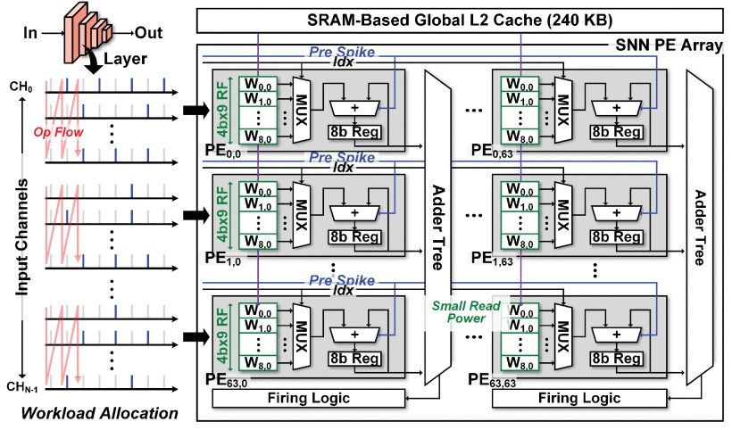
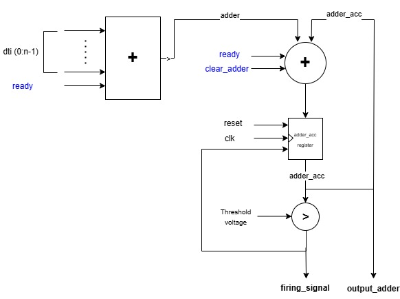
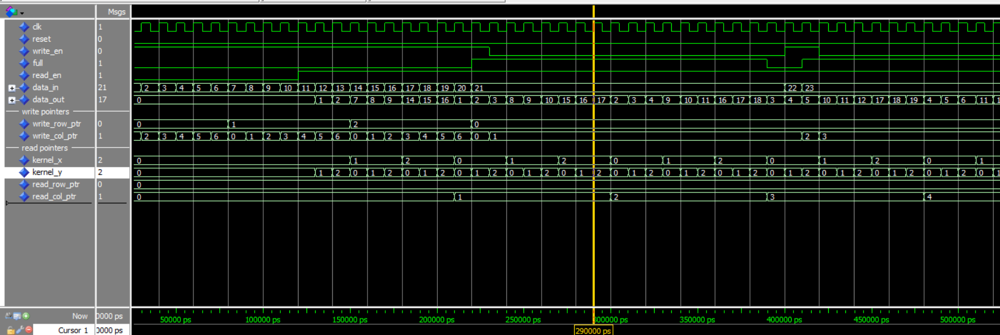
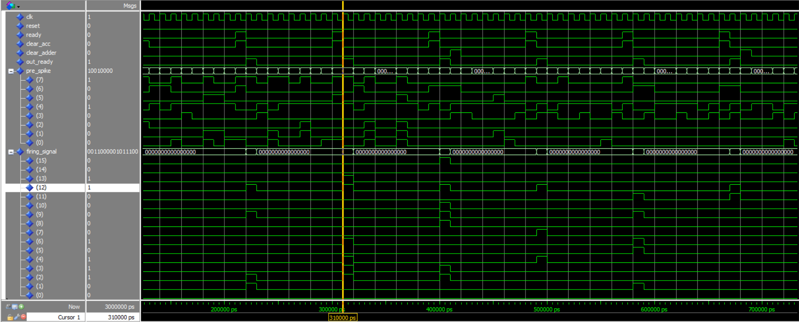

# VHDL Design for SNN Inference Module

This folder contains RTL level the VHDL implementation of the Spiking Neural Network (SNN) inference module. It also has the Scratchpad design which schedules the input spikes for convolution operation in inference core.

## Design Overview

### Architecture
The SNN inference module processes input spikes through:
- **Scratchpad Memory**: Efficiently schedules input spikes for the convolution operation in Processing Element (PE) array.
- **PE Array**: Performs convolution operations using temporal weight reuse.
- **Adder Tree and Firing Logic**: Performs columnwise accumulation of results from PE elements across timesteps and generates output spikes.

#### High-Level Architecture

The architecture is divided into modular components for scalability and maintainability.

---

## Key Components

### 1. Scratchpad Memory
A circular buffer that schedules input spikes for convolution operations. It has separate read and write pointers to manage concurrent data input and output.

- **Features**:
  - Ensures no overwriting of unread data.
  - Supports various kernel sizes and input dimensions.

#### Scratchpad Design

### 2. Processing Element (PE) Array
The PE array consists of `64x64` processing elements. Each PE processes spikes from pre-neurons with weights stored in an L1 cache, allowing temporal weight reuse to minimize memory access overhead.

### 3. Adder Tree and Firing Logic
The adder tree aggregates convolution results from the PE array, while the firing logic determines if the neuron spikes based on the accumulated membrane potential.

- **Features**:
  - Membrane potential accumulation over timesteps.
  - Threshold-based spike generation with reset logic.

#### Adder Tree Design

---

## File Structure

- **`util.vhd`**: Defines composite datatypes used in the modules.
- **`snn_pe_array.vhd`**: Defines the `64x64` PE array.
- **`adder_tree.vhd`**: Implements the adder tree for aggregating results.
- **`inf_logic.vhd`**: Connects SRAM to accumulator via the Multiplexer for convolution operaation.
- **`mux_generic.vhd`**: Multiplexer for weight selection.
- **`sram_generic.vhd`**: SRAM moduleused as L1 cache for storing weights of pre-neurons.
- **`add_acc.vhd`**: Handles accumulation of weights.

- **`scratchpad_memory.vhd`**: Circular memory for input spike scheduling.

---

## Simulation and Verification

The design has been verified using testbenches and Modelsim simulations.

### Scratchpad Simulation

### PE Array Simulation

## Design Attribution

The design of the SNN inference module is based on the architecture described in the paper:

- **Title**: "C-DNN: An Energy-Efficient Complementary Deep-Neural-Network Processor With Heterogeneous CNN/SNN Core Architecture"
- **Authors**: Sangyeob Kim et al.
- **Published in**: IEEE Journal of Solid-State Circuits, 2024.
- **DOI**: [10.1109/JSSC.2023.3330483](https://doi.org/10.1109/JSSC.2023.3330483)

